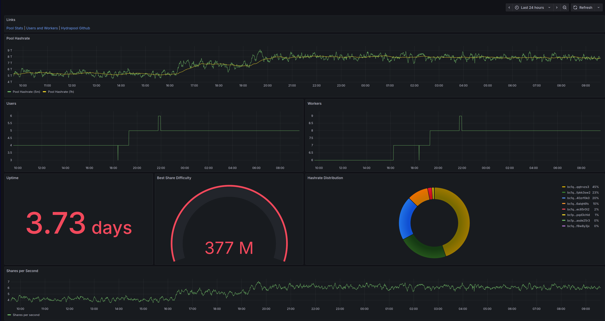
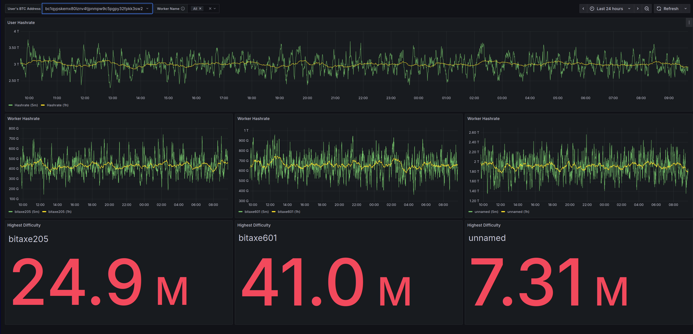

# Hydrapool

[Hydrapool](https://hydrapool.org) is an open Source Bitcoin Mining
Pool with support for solo mining and PPLNS accounting.

We have an instance mining on mainnet at
[test.hydrapool.org](https://test.hydrapool.org). But we hope you'll
run a pool for yourself. See below on [how to run your own instance](#run). We
only accomodate up to 20 users atm for coinbase and block weight
reasons, workers are limited by your hardware.

## Features

1. Run a private solo pool or a private PPLNS pool for your community
   of miners.
2. Payouts are made directly from coinbase - pool operator doesn't
   custody any funds. No need to trust the pool operator.
3. Let users download and validate the accounting of shares. We
   provide an API for the same. See [API Server](#api)
3. Prometheus and Grafana based dashboard for pool, user and worker
   hashrates and uptimes.
4. Use any bitcoin node that supports bitcoin RPC.
5. Implemented in Rust, for ease of extending the pool with novel
   accounting and payout schemes.
6. Open source with GPlv3. Feel free to extend and/or make changes.

## Limitation

Currently we limit 20 users, but this limit will be removed in the
future. This limit is in place to allow all older hardware that has a
limit on the size of the coinbase.

<a id="run"></a>
# Running Your Own Hydrapool Instance

## Run with Docker

We provide Dockerfile and docker compose files to run hydrapool using
Docker as well.

1. Download docker compose and pool config file

```bash
curl --proto '=https' --tlsv1.2 -LsSf -o docker-compose.yml https://github.com/256foundation/hydrapool/releases/latest/download/docker-compose.yml
curl --proto '=https' --tlsv1.2 -LsSf -o config.toml https://github.com/256foundation/hydrapool/releases/latest/download/config-example.toml
```

2. Edit config.toml

Edit the file to provide details for your own bitcoin node.

At the very least you will need to edit bitcoinrpc, zmqpubhashblock
and network (signet/main) to match your bitcoin node's settings. If
you use main network, change the bootstrap_address too.

2. Start pool

```bash
docker compose up -d docker-compose.yml
```

The above will start hydrapool stratum server on port 3333. A
monitoring dashboard on port 3000. If you are running on localhost,
`stratum://localhost:3333` and dashboard at
`http://localhost::3000`.

#### Pool Dashboard

The `Pool` dashboard shows the hashrate of the pool, the shares per
second, max difficulty reached by any of the workers. It also charts
the total number of users and workers in the pool over time and shows
the hashrate distribution between users mining on the pool.



#### Users and Hashrate Dashboard

Th users dashboard shows the stats for a selected user. The current
dashboard shows all users btcaddresses mining on the pool, and there
is a private dashboard where you have to provide the user's btcaddress
to view stats. By default the public dashboard is used.

The dashboard shows the hashrate of the all their workers as well as
individual hashrate for all their workers. They can also filter their
workers by selecting specific workers from the workers drop down on
the top.



### Public Dashboard

To provide public facing dashboard, we recommend using nginx/apache as
a reverse proxy and running the dashboard as a system service.

Also see the section on securing the server for securing your API
server.

## Verify Docker Image Signatures

To verify docker images [install
cosign](https://docs.sigstore.dev/cosign/system_config/installation/)
and then verify using:

```bash
cosign verify \
    --certificate-identity-regexp=github.com/256foundation \
    ghcr.io/256-foundation/hydrapool:<TAG>
```

<a id="secure"></a>
## Securing your Server

If you provide public access to your api server, you can require
authentication to access the server. Edit the `auth_user` and
`auth_token` in config.toml.

We provide a command line tool to generate the salt and hashed
password to use in your config file.

```
docker compose run --rm hydrapool-cli gen-auth <USERNAME> <PASSWORD>
```

The above will generate config lines for pasting into your
config.toml.

Once the password is changed, you need to share that with your
prometheus setup. The same credentials will also be used to access the
API Server.

To update prometheus with your new credentials:

1. Copy the prometheus configuration template:
```bash
cp prometheus/prometheus.yml docker/prometheus.yml
```

2. Edit `docker/prometheus.yml` and change the username and password to match what was output by hydrapool_cli above:
```yaml
    basic_auth:
      username: '<USERNAME>'
      password: '<PASSWORD>'
```

3. Restart the prometheus service:
```bash
docker compose restart prometheus
```

Note: By default, prometheus uses the built-in configuration with credentials `hydrapool/hydrapool`. Creating a custom `docker/prometheus.yml` file overrides this default configuration.

<a id="api"></a>
## API Server

When you start the mining pool an API server is also started on the
port you specify in the config file.

The API Server is secured using the credentials you provide in the
config file. These credentials are used by prometheus to build the
dashboard and for your users to download shares for validating the
accounting and payouts.

Go to `http://<your_server_ip>:<your_api_server_port>/pplns_shares` to
download a json file of all the PPLNS Shares tracked by the pool for
distributing the block rewards.

The above URL accepts optional query parameters `start_time` and
`end_time` in RFC3339 format, e.g. `1996-12-19T16:39:57-08:00` to
limit the range of pplns shares to download.

To expose the API Server to public, we recommend using nginx as a
reverse proxy for the port, just like for the prometheus/grafana
dashboard.


# Other Options to Run Hydrapool

## Build from Source

To build from source, use cargo.

```
git clone https://github.com/256-foundation/Hydra-Pool/
cargo build --release
```

Then run from target directory.

```
./target/release/hydrapool
```

## Install Hydrapool Binaries

```bash
curl --proto '=https' --tlsv1.2 -LsSf https://github.com/256-Foundation/Hydra-Pool/releases/latest/download/hydrapool-installer.sh | sh
```

The above will install two binaries in your path:

1. `hydrapool` - the binary to start the pool.
2. `hydrapool_cli` - a utility to query the state of the pool, generate authentication tokens etc.

Both binaries come with the `--help` option that document the other
options and commands they support.

Binaries are available on the
[releases](https://github.com/256-Foundation/Hydra-Pool/releases)
page. We provide Linux, Windows and MacOS binaries. Go to releases
page to access an older release.

To run dashboard, we still recommned using docker

```
docker compose up -d ghcr.io/256foundation/hydrapool-prometheus
docker compose up -d ghcr.io/256foundation/hydrapool-grafana
```
